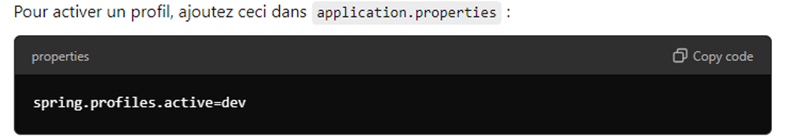

# Spring Boot Interview

# 📚 Sommaire – Spring Boot Interview 2

- #1🧩 1. Spring Boot Setup : Initialisation de projet avec Spring Initializr
- #2🧩 2. Dépendances Maven/Gradle (`spring-boot-starter`)
- #3🧩 3. Fichier de configuration `application.properties` ou `application.yml`
- #4🧩 4. Profil Spring (`@Profile`)
- #5🧩 5. Spring Boot Autoconfiguration (`@EnableAutoConfiguration`)
- #6🧩 6. Customisation via des Beans (`@Bean`)
- #7🧩 7. Spring Boot DevTools
- #8🧩 8. Rechargement à chaud (`spring-boot-devtools`)
- #9🧩 9. Outils de diagnostic de développement
- #10🧩 10. JPA – Entités (`@Entity`)
- #11🧩 11. Relations entre entités
- #12🧩 12.1. Validation des données (`@Valid`, `@NotNull`, `@Size`)
- #13🧩 12.2. Messages d'erreur personnalisés avec BindingResult
- #14🧩 13. REST API avec Spring Boot / JSON Jackson
- #15🧩 14. Méthodes CRUD par défaut (`findAll()`, `findById()`, `save()`, `delete()`)
- #16🧩 15. Requêtes personnalisées via `@Query` ou conventions
- #17🧩 16. Transactions avec `@Transactional`
- #18🧩 17. Propagation des transactions
- #19🧩 18. Exceptions et rollback
- #20🧩 19. Transactions en lecture seule
- #21🧩 20. Gestion de la concurrence avec @Version (Optimistic Locking) / Verrouillage pessimiste avec EntityManager
- #22🧩 21. Spring Security
- #23🧩 21.1 Concepts fondamentaux
- #24🧩 21.2 Annotations essentielles
- #25🧩 21.3. Annotations principales dans Spring Security
- #26🧩 21.4. Gestion des filtres de sécurité
- #27🧩 21.5. Gestion des JWT (JSON Web Tokens)
- #28🧩 21.6. Stockage sécurisé des tokens
- #29🧩 22. OAuth2 Integration (Authentification via un fournisseur tiers)
- #30🧩 23. Gestion des erreurs : gestion globale des exceptions
- #31🧩 24. Création de réponses d’erreur personnalisées (HTTP 400, 500, …)
- #32🧩 25. Tests unitaires
- #33🧩 25.1. Test unitaire simple avec JUnit
- #34🧩 25.2. Test unitaire avec Mockito (`@Mock`, `@InjectMocks`, `@BeforeEach`)
- #35🧩 24.3. Initialisation et nettoyage avec `@BeforeEach` et `@AfterEach`
- #36🧩 25.4. Test de chargement du contexte Spring Boot
- #37🧩 26. Exemples de tests unitaires en Spring Boot
- #38🧩 27. Gestion des fichiers multipart (`MultipartFile`)
- #39🧩 28. Sauvegarde des fichiers sur le disque
- #40🧩 29. Téléchargement via endpoint REST
- #41🧩 30. Génération et lecture de fichiers CSV, Excel (Apache POI)
- #42🧩 31. Création de PDF via iText
- #43🧩 32.1. Gestion des événements : Exécution asynchrone avec `@Async`
- #44🧩 31.2. Exemple complet : Création et gestion d’un événement personnalisé
- #45🧩 33. Gestion des tâches longues avec `ExecutorService`
- #46🧩 34. Planification de tâches avec `@Scheduled`
- #47🧩 35. Documentation Swagger avec annotations
- #48🧩 36. Mise en cache avec Spring Cache (EHCache, Caffeine)
- #49🧩 37. Logging et Monitoring
- #50🧩 38. Spring Cloud & Microservices
- #51🧩 39. RestTemplate
- #52🧩 41. WebClient – Client HTTP non bloquant (Spring WebFlux)
- #53🧩 42. JPA Criteria API – Recherche dynamique avec Predicates
- #54🧩 43. Spring Boot + Kafka – Intégration Complète
- #55🧩 44. Spring Batch – Traitement des commandes livrées
- #56🧩 45. Exemple complet CRUD avec Spring Boot : Gestion de Livres
- #57🧩 46. API Versioning
- #58🧩 47. Docker & Deployment
- #59🧩 48. Spring Boot Migration avec Liquibase

## 🧩 **1. Spring Boot Setup : Initialisation de projet avec Spring Initializr**

Spring Initializr est un outil pour générer une structure de projet Spring Boot avec les dépendances choisies (Spring Web, JPA, Security, etc.), le nom de projet, la version de Java, et le type de build (Maven/Gradle).

👉 [https://start.spring.io](https://start.spring.io/)

---

## 🧩 **2. Dépendances Maven/Gradle (`spring-boot-starter`)**

Spring Boot utilise des "starters" (préconfigurations) qui intègrent les dépendances nécessaires à une fonctionnalité.

**Exemples :**

```xml
<!-- Pour une application Web -->
<dependency>
  <groupId>org.springframework.boot</groupId>
  <artifactId>spring-boot-starter-web</artifactId>
</dependency>

<!-- Pour JPA -->
<dependency>
  <groupId>org.springframework.boot</groupId>
  <artifactId>spring-boot-starter-data-jpa</artifactId>
</dependency>
```

---

## 🧩 **3. Fichier de configuration `application.properties` ou `application.yml`**

Ces fichiers servent à définir les paramètres comme :

- port du serveur
- configuration BDD
- comportement spécifique à l’environnement

**Exemple (`application.yml`) :**

```yaml
server:
  port: 8081

spring:
  datasource:
    url: jdbc:mysql://localhost:3306/mydb
```

---

## 🧩 **4. Profil Spring (`@Profile`)**

Permet d’activer ou désactiver des beans selon l’environnement (`dev`, `prod`, `test`).

**Exemple :**

```java
@Profile("dev")
@Bean
public DataSource devDataSource() {
    return new H2DataSource();
}
```



## 🧩 **5. Spring Boot Autoconfiguration (`@EnableAutoConfiguration`)**

Spring Boot configure automatiquement des composants en fonction des dépendances détectées. Cela signifie que vous n'avez pas besoin de configurer manuellement de nombreuses choses, comme le serveur web ou la base de données.

Exemple : si `spring-boot-starter-web` est présent, un serveur Tomcat sera automatiquement configuré.

## 🧩 **6. Customisation via des Beans (`@Bean`)**

Vous pouvez personnaliser un composant Spring (ex: encoder, config DB) via la déclaration manuelle d’un bean.

**Exemple :**

```java
@Configuration
public class AppConfig {
    @Bean
    public PasswordEncoder passwordEncoder() {
        return new BCryptPasswordEncoder();
    }
}
```

Ce bean **`@PasswordEncoder`** sera disponible sans tout le contexte Spring.

## 🧩 **7. Spring Boot DevTools**

DevTools permet le redémarrage automatique de l'application après modification du code (sans redémarrage manuel).


## 🧩 **8. Rechargement à chaud (`spring-boot-devtools`)**

Active le hot-reload de l’application. Il détecte les changements de fichiers et redémarre automatiquement sans perturber la session.

---

## 🧩 **9. Outils de diagnostic de développement**

Avec DevTools, vous bénéficiez d’outils comme :

- traçage des requêtes
- visualisation des erreurs
- journalisation détaillée

## 🧩 **10. JPA – Entités (`@Entity`)**

Les entités JPA représentent les objets métiers liés aux tables d'une base de données. Chaque entité est associée à une table grâce à l’annotation `@Entity`.

- **`@Entity`** : Indique que la classe est une entité JPA et qu’elle correspond à une table dans la base de données.
- **`@Table`** : Permet de définir des informations supplémentaires sur la table, comme son nom, si celui-ci diffère du nom de la classe.
- **`@Id`** : Spécifie que le champ annoté est la clé primaire de la table.
- **`@GeneratedValue`** : Détermine la stratégie de génération automatique de la clé primaire. Les stratégies possibles sont :
    - `AUTO`
    - `IDENTITY` (souvent utilisée pour les colonnes auto-incrémentées)
    - `SEQUENCE`
    - `TABLE`

**Exemple :**

```java
@Entity
@Table(name = "users")
public class User {
    @Id
    @GeneratedValue(strategy = GenerationType.IDENTITY)
    private Long id;

    private String name;
}
```

## 🧩 **11. Relations entre entités**

Ces annotations permettent de définir les **relations entre les entités JPA**, reflétant les liens logiques entre les tables de la base de données.

- **`@OneToOne`** (relation un-à-un) :
    
    Indique qu’une entité est liée à une seule instance d’une autre entité.
    
    *Exemple* : Un `User` possède un seul `Profile`, et chaque `Profile` est lié à un seul `User`.
    
    ```java
    @OneToOne
    private Profile profile;
    ```
    
- **`@OneToMany`** (relation un-à-plusieurs) :
    
    Une entité peut être liée à plusieurs instances d’une autre entité.
    
    *Exemple* : Un `User` peut avoir plusieurs `Order`.
    
    ```java
    @OneToMany(mappedBy = "user")
    private List<Order> orders;
    ```
    
- **`@ManyToOne`** (relation plusieurs-à-un) :
    
    Plusieurs instances d’une entité peuvent être liées à une seule instance d’une autre entité.
    
    *Exemple* : Plusieurs `Order` peuvent être associés à un seul `User`.
    
    ```java
    @ManyToOne
    private User user;
    ```
    
- **`@ManyToMany`** (relation plusieurs-à-plusieurs) :
    
    Une entité peut être liée à plusieurs instances d’une autre entité, et inversement.
    
    *Exemple* : Un `User` peut avoir plusieurs `Role`, et chaque `Role` peut être attribué à plusieurs `User`.
    
    ```java
    @ManyToMany
    private List<Role> roles;
    ```
    
- **`@JoinColumn`** :
    
    Utilisée pour préciser la colonne de jointure (clé étrangère) dans les relations comme `@ManyToOne` ou `@OneToOne`.
    
    *Exemple* :
    
    ```java
    @ManyToOne
    @JoinColumn(name = "user_id")
    private User user;
    ```
    


## 🧩 **12.1. Validation des données (`@Valid`, `@NotNull`, `@Size`)**

Spring permet de valider les champs automatiquement avant traitement avec des annotations.

Les annotations de validation permettent de **vérifier les données entrantes** avant leur traitement, garantissant l’intégrité des objets manipulés.

- **`@NotNull`** : Vérifie que le champ n’est pas nul.
- **`@Size`** : Définit des contraintes de taille sur les chaînes ou les collections (par exemple : longueur minimale ou maximale).
- **`@Valid`** : Utilisée dans les contrôleurs pour déclencher la validation des objets complexes (par exemple, une entité contenant d’autres objets).
    
    Si la validation échoue, une erreur est automatiquement renvoyée.
    

**Exemple :**


## 🧩 **12.2. Messages d'erreur personnalisés avec BindingResult**

`BindingResult` est utilisé pour capturer les erreurs de validation et retourner des messages d'erreur
personnalisés.


## 🧩 **13. REST API avec Spring Boot / JSON Jackson**

Dans le cadre du développement d'APIs RESTful avec Spring, il est essentiel de mapper les requêtes web aux méthodes de gestion dans les contrôleurs. Voici une explication détaillée des annotations et concepts clés utilisés pour cette tâche :

**1. Annotations de Mapping Spécifiques :**

Ces annotations sont des versions spécialisées de `@RequestMapping` pour gérer différentes méthodes HTTP spécifiques. Elles permettent de définir explicitement le type de requête HTTP que chaque méthode du contrôleur peut traiter.

- **@GetMapping** : Utilisée pour les requêtes HTTP GET. Elle est généralement utilisée pour récupérer des données.
- **@PostMapping** : Utilisée pour les requêtes HTTP POST. Elle est généralement utilisée pour créer de nouvelles ressources.
- **@PutMapping** : Utilisée pour les requêtes HTTP PUT. Elle est généralement utilisée pour mettre à jour des ressources existantes.
- **@DeleteMapping** : Utilisée pour les requêtes HTTP DELETE. Elle est généralement utilisée pour supprimer des ressources.
- **@PatchMapping** : Utilisée pour les requêtes HTTP PATCH. Elle est généralement utilisée pour effectuer des mises à jour partielles de ressources.

**2. Extraction de Données depuis la Requête :**

Les annotations suivantes permettent d'accéder aux différents éléments d'une requête HTTP :

- **@PathVariable** : Permet d'extraire des valeurs provenant de l'URI de la requête. Par exemple, `/users/{id}` où `{id}` est un paramètre dynamique.
- **@RequestParam** : Permet d'accéder aux paramètres transmis via la requête (GET ou POST). Ces paramètres peuvent être passés dans l'URL ou dans le corps de la requête.
- **@RequestHeader** : Permet de récupérer les en-têtes HTTP transmis avec la requête.
- **@RequestBody** : Permet de lier le corps de la requête HTTP (généralement au format JSON) à un objet Java. Cela est utile pour les requêtes POST ou PUT qui incluent des données dans leur corps.

**3. Gestion des Réponses :**

- **@ResponseStatus** : Permet de spécifier explicitement le code de statut HTTP de la réponse. Par exemple, `HttpStatus.CREATED` pour indiquer une création réussie, ou `HttpStatus.NO_CONTENT` pour indiquer qu'une suppression a été effectuée sans retour de contenu.

**4. Sérialisation et Désérialisation avec Jackson :**

Jackson est une bibliothèque populaire utilisée pour convertir des objets Java en JSON et vice versa. Les annotations suivantes facilitent ce processus :

- **@JsonProperty** : Permet de renommer un champ lors de la conversion d'un objet Java en JSON. Par exemple, un champ `name` pourrait être renommé en `full_name` dans le JSON.
- **@JsonIgnore** : Permet d'exclure un champ spécifique de la sérialisation JSON. Cela est utile pour ignorer des champs sensibles comme les mots de passe.

**Example of Code:**

**✅ Classe `User` avec annotations Jackson**

```java
// Classe User avec sérialisation personnalisée JSON
public class User {

    // Ce champ sera exposé en tant que "full_name" dans le JSON
    @JsonProperty("full_name")
    private String name;

    // Ce champ sera ignoré lors de la sérialisation JSON
    @JsonIgnore
    private String password;

    // Getters et Setters
    public String getName() {
        return name;
    }

    public void setName(String name) {
        this.name = name;
    }

    public String getPassword() {
        return password;
    }

    public void setPassword(String password) {
        this.password = password;
    }
}
```

---

**✅ Contrôleur REST `UserController`**

```java
@RestController
@RequestMapping("/api/users")
public class UserController {

    @Autowired
    private UserService userService;

    // GET /api/users : Récupère tous les utilisateurs
    @GetMapping
    public List<User> getAllUsers() {
        return userService.getAllUsers();
    }

    // GET /api/users/{id} : Récupère un utilisateur par ID
    @GetMapping("/{id}")
    public ResponseEntity<User> getUserById(@PathVariable Long id) {
        return userService.getUserById(id)
                .map(ResponseEntity::ok)
                .orElse(ResponseEntity.notFound().build());
    }

    // POST /api/users : Crée un nouvel utilisateur
    @PostMapping
    @ResponseStatus(HttpStatus.CREATED)
    public User createUser(@Valid @RequestBody User user) {
        return userService.createUser(user);
    }

    // PUT /api/users/{id} : Met à jour un utilisateur existant
    @PutMapping("/{id}")
    public ResponseEntity<User> updateUser(@PathVariable Long id, @Valid @RequestBody User user) {
        return userService.updateUser(id, user)
                .map(ResponseEntity::ok)
                .orElse(ResponseEntity.notFound().build());
    }

    // DELETE /api/users/{id} : Supprime un utilisateur
    @DeleteMapping("/{id}")
    @ResponseStatus(HttpStatus.NO_CONTENT)
    public void deleteUser(@PathVariable Long id) {
        userService.deleteUser(id);
    }

    // GET /api/users/search?name=...&email=... : Recherche des utilisateurs
    @GetMapping("/search")
    public List<User> searchUsers(
            @RequestParam(required = false) String name,
            @RequestParam(required = false) String email) {
        return userService.searchUsers(name, email);
    }
}
```

## 🧩 **14. Méthodes CRUD par défaut (`findAll()`, `findById()`, `save()`, `delete()`)**

Proposées par `JpaRepository`, elles permettent les opérations de base sans écrire de code SQL.


## 🧩 **15. Requêtes personnalisées via `@Query` ou conventions**

- `@Query` permet d’écrire une requête JPQL personnalisée
- `findByEmail()` utilise la convention de nommage

**Exemple :**

```java
@Query("SELECT u FROM User u WHERE u.name = :name")
List<User> findByName(@Param("name") String name);
```

## 🧩 **16. Transactions avec `@Transactional`**

L'annotation **`@Transactional`** est un élément clé pour gérer les transactions dans Spring. Elle garantit que toutes
les opérations sur la base de données au sein d'une méthode annotée sont exécutées dans le cadre d'une seule
transaction.
En utilisant l'annotation **`@Transactional`**, Spring démarre une transaction au début de la méthode et la
termine une fois la méthode terminée. Si une exception non vérifiée (unchecked) se produit, la transaction est
annulée (**rollback**).

## 🧩 **17. Propagation des transactions**

La **propagation d'une transaction** définit la manière dont une méthode annotée avec `@Transactional` se comporte vis-à-vis d'une transaction déjà active.

- **`Propagation.REQUIRED`** (*valeur par défaut*) :
    
    Si une transaction est déjà en cours, la méthode y participe. Sinon, une **nouvelle transaction est démarrée** automatiquement.
    
- **`Propagation.REQUIRES_NEW`** :
    
    Une **nouvelle transaction est systématiquement créée**, même si une autre est déjà active. La transaction existante est alors temporairement suspendue pendant l’exécution de la méthode.
    

**Exemple :**

```java
@Transactional(propagation = Propagation.REQUIRES_NEW)
public void saveAuditLog(AuditLog log) {
auditLogRepository.save(log);
}
```

---

Dans cet exemple, la méthode `saveAuditLog` s’exécute dans **une transaction totalement indépendante** de celle éventuellement active.

Même si la **transaction principale échoue**, l’opération d’enregistrement du `AuditLog` sera **quand même validée (committée)**.

## 🧩 **18. Exceptions et rollback**

Par défaut, **Spring effectue un rollback** (annulation de la transaction) **uniquement si une exception non vérifiée** est levée, c’est-à-dire :

- Une **`RuntimeException`**
- Ou une **`Error`**

⚠️ Si vous souhaitez que **les exceptions vérifiées** (*checked exceptions*, comme `Exception`) provoquent également un rollback, vous devez **le spécifier explicitement** avec l’attribut `rollbackFor`.

```java
@Transactional(rollbackFor = Exception.class)
public void processPayment(Order order) throws Exception {
    paymentService.process(order);
}
```

Dans cet exemple, même si une exception vérifiée (`Exception`) est levée, **la transaction sera annulée** grâce au `rollbackFor`.

## 🧩 **19. Transactions en lecture seule**

L’option `readOnly`est utilisée pour indiquer que la transaction ne modifie pas les données. Cela permet à Spring d'optimiser certaines opérations.

```java
@Transactional(readOnly = true)
public List<User> findAll() {
    return userRepository.findAll();
}
```

## 🧩 **20. Gestion de la concurrence avec @Version (Optimistic Locking) / Verrouillage pessimiste avec EntityManager**

***Verrouillage optimiste avec `@Version`***

`@Version` est une annotation utilisée pour implémenter le **verrouillage optimiste** dans JPA.

Cette stratégie permet de gérer les conflits lorsque plusieurs utilisateurs ou transactions modifient une même ressource.

**Principe :**

- Lorsqu'un enregistrement est lu, une **version** est enregistrée.
- Lorsqu’il est mis à jour, cette version est comparée à celle en base.
- Si les versions ne correspondent pas, cela signifie qu’un autre utilisateur l’a déjà modifié, donc une **`OptimisticLockException`** est levée.

**Exemple :**

```java
@Entity
public class Product {
    @Id
    private Long id;

    @Version
    private Integer version;
}
```

Le champ `version` dans une entité JPA est utilisé pour gérer la concurrence via un verrouillage optimiste. Chaque mise à jour de l'entité entraîne une incrémentation de cette colonne dans la base de données.

**Exemple de scénario :**

Imaginons deux utilisateurs, **Alice** et **Bob**, qui modifient simultanément un produit :

1. Alice récupère le produit avec `version = 1`.
2. Bob récupère le même produit avec `version = 1`.
3. Alice modifie le produit et l’enregistre. La version devient `2`.
4. Bob essaie aussi de modifier et sauvegarder. Mais comme la version en base est maintenant `2` alors que lui a encore `version = 1`, une **exception est levée**. Sa transaction échoue.

---

**💼 Exemple de service Spring avec gestion de la concurrence**

```java
@Service
public class ProductService {

    @Autowired
    private ProductRepository productRepository;

    @Transactional
    public void updateProductPrice(Long productId, Double newPrice) {
        Product product = productRepository.findById(productId)
            .orElseThrow(() -> new RuntimeException("Produit non trouvé"));

        product.setPrice(newPrice);
        productRepository.save(product);
    }
}
```

> Grâce au verrouillage optimiste, si deux utilisateurs essaient de modifier le même produit en parallèle, seule la transaction avec la version la plus récente sera validée, assurant ainsi l'intégrité des données.
> 

**Exception de verrouillage optimiste**

Lorsque deux transactions essaient de modifier la même ressource, l’une d’elles peut échouer avec une exception `OptimisticLockException`.

Il est possible de capturer cette exception et de gérer le conflit (affichage d’un message, relancer la transaction...).


***Verrouillage pessimiste avec `EntityManager`***

Le **verrouillage pessimiste** empêche les autres transactions d’accéder à un enregistrement tant que celui-ci est utilisé.

**Utilité :** garantir qu’aucune autre transaction ne modifie les données en parallèle.

**Exemple :**


## 🧩 **21. Spring Security**

**Spring Security** est un module puissant du framework Spring, conçu pour sécuriser les applications. Il prend en charge l'**authentification** et l'**autorisation**, tout en proposant divers mécanismes de sécurité :

- Gestion des utilisateurs
- Attribution de rôles et permissions
- Protection contre les attaques **CSRF** (Cross-Site Request Forgery)
- Chaîne de **filtres de sécurité**
- Et bien d’autres fonctionnalités avancées

---

## 🧩 21.1.1 Concepts fondamentaux

- **Authentification** : C’est le processus de vérification de l’identité d’un utilisateur, généralement via un couple *login/mot de passe*.
- **Autorisation** : Une fois authentifié, ce processus détermine si l'utilisateur a les droits requis pour accéder à une ressource ou effectuer une action.
- **Filtres de sécurité** : Chaque requête HTTP traverse une chaîne de filtres chargée de contrôler l’authentification et l'autorisation.

---

## 🧩 21.1.2 Concepts fondamentaux

Spring Security repose sur plusieurs **concepts essentiels** permettant d’assurer une gestion complète de la sécurité (authentification, autorisation, et protection des ressources).

### 🔐 **Authentification**

C’est le processus de vérification de l’identité d’un utilisateur (par exemple, via un couple *login/mot de passe*).

Une fois authentifié, Spring Security crée un objet `Authentication` contenant les informations de l’utilisateur.

---

### 🧾 **Autorisation**

Une fois l’identité vérifiée, l’autorisation détermine si l’utilisateur a les droits nécessaires pour accéder à une ressource donnée.

Elle s’appuie sur les **rôles** (`ROLE_ADMIN`, `ROLE_USER`, etc.) ou sur des **permissions fines**.

---

### ⚙️ **Filtres de sécurité**

Chaque requête HTTP traverse une **chaîne de filtres (Security Filter Chain)** chargée d’appliquer les règles d’authentification et d’autorisation.

Chaque filtre peut intercepter, valider ou rejeter une requête.

---

### 👤 **UserDetails**

C’est une interface représentant un utilisateur dans Spring Security.

Elle contient des informations comme le nom d’utilisateur, le mot de passe, les rôles, et l’état du compte (actif, expiré, verrouillé, etc.).

Exemple d’implémentation :

```java
public class CustomUserDetails implements UserDetails {
    private User user;

    public CustomUserDetails(User user) {
        this.user = user;
    }

    @Override
    public Collection<? extends GrantedAuthority> getAuthorities() {
        return List.of(new SimpleGrantedAuthority(user.getRole()));
    }

    @Override
    public String getPassword() { return user.getPassword(); }

    @Override
    public String getUsername() { return user.getEmail(); }

    @Override
    public boolean isAccountNonExpired() { return true; }

    @Override
    public boolean isAccountNonLocked() { return true; }

    @Override
    public boolean isCredentialsNonExpired() { return true; }

    @Override
    public boolean isEnabled() { return user.isEnabled(); }
}

```

---

### 🧩 **UserDetailsService**

C’est une interface clé utilisée pour charger les informations d’un utilisateur à partir d’une source de données (souvent une base de données).

Elle joue un rôle central dans le processus d’authentification.

Exemple :

```java
@Service
public class CustomUserDetailsService implements UserDetailsService {

    @Autowired
    private UserRepository userRepository;

    @Override
    public UserDetails loadUserByUsername(String email) throws UsernameNotFoundException {
        return userRepository.findByEmail(email)
                .map(CustomUserDetails::new)
                .orElseThrow(() -> new UsernameNotFoundException("Utilisateur non trouvé"));
    }
}

```

---

### 🔑 **PasswordEncoder**

C’est un composant qui permet de chiffrer les mots de passe avant de les stocker dans la base de données et de vérifier leur correspondance lors de l’authentification.

Spring propose plusieurs implémentations, comme `BCryptPasswordEncoder`.

Exemple :

```java
@Bean
public PasswordEncoder passwordEncoder() {
    return new BCryptPasswordEncoder();
}

```

---

### 🧠 **AuthenticationManager**

Ce composant central orchestre le processus d’authentification.

Il délègue la vérification des identifiants à un ou plusieurs `AuthenticationProvider`.

Exemple :

```java
@Autowired
private AuthenticationManager authenticationManager;

public Authentication authenticate(String email, String password) {
    UsernamePasswordAuthenticationToken authToken =
        new UsernamePasswordAuthenticationToken(email, password);
    return authenticationManager.authenticate(authToken);
}

```

---

### 🧰 **AuthenticationProvider**

Interface responsable de la logique d’authentification réelle.

Chaque implémentation valide les identifiants et retourne un objet `Authentication` si la vérification réussit.

---

### 📦 **SecurityContextHolder**

C’est la classe qui stocke le **contexte de sécurité courant**, incluant l’objet `Authentication` du user connecté.

Elle permet d’accéder aux informations de l’utilisateur dans n’importe quelle partie de l’application.

Exemple :

```java
Authentication auth = SecurityContextHolder.getContext().getAuthentication();
String username = auth.getName();

```

---

### 🔄 **SecurityContext**

Objet qui encapsule l’état de sécurité de la session en cours (l’utilisateur authentifié, ses rôles, etc.).

Il est souvent stocké dans le `SecurityContextHolder`.

---

### 🧱 **SecurityFilterChain**

Définit la configuration des filtres de sécurité et des règles d’accès dans Spring Boot moderne (à partir de Spring Security 5.7+).

Exemple :

```java
@Bean
public SecurityFilterChain securityFilterChain(HttpSecurity http) throws Exception {
    http
        .csrf().disable()
        .authorizeHttpRequests(auth -> auth
            .requestMatchers("/auth/**").permitAll()
            .anyRequest().authenticated()
        )
        .sessionManagement(session -> session.sessionCreationPolicy(SessionCreationPolicy.STATELESS))
        .authenticationProvider(authenticationProvider())
        .addFilterBefore(jwtAuthFilter, UsernamePasswordAuthenticationFilter.class);

    return http.build();
}

```

---

## 🧩 21.2 Annotations essentielles

- **`@EnableWebSecurity`** : Active le module de sécurité Spring pour l'application. Elle permet de définir la configuration de sécurité, notamment la gestion des accès aux différentes routes HTTP.


## 🧩 21.3. Annotations principales dans Spring Security

Spring Security propose plusieurs annotations pour gérer l’accès aux ressources :

- **`@PreAuthorize`** : Permet de restreindre l’accès à une méthode d’un service ou d’un contrôleur en fonction de rôles ou de permissions. Elle offre une grande flexibilité grâce à l'utilisation d'expressions SpEL.


- **`@Secured`** : Fournit une manière plus simple de restreindre l'accès à des méthodes en fonction des rôles. Moins flexible que `@PreAuthorize`, mais utile pour les cas simples.


- **`@RolesAllowed`** : Semblable à `@Secured`, mais basée sur la spécification JSR-250. Elle est souvent utilisée dans les projets conformes aux standards Java EE.


Par ailleurs, **`UserDetailsService`** est un composant central de Spring Security utilisé pour charger les informations d’un utilisateur à partir d’une source de données (comme une base de données). Il est essentiel pour l’authentification.


## 🧩 21.4. Gestion des filtres de sécurité

Spring Security repose sur une chaîne de filtres (`FilterChain`) qui interceptent les requêtes HTTP avant qu'elles n'atteignent les contrôleurs. Ces filtres permettent de gérer des opérations telles que l’authentification, la validation de tokens (comme JWT), etc.

- **`OncePerRequestFilter`** : Garantit que le traitement défini dans le filtre ne s’exécute qu’une seule fois par requête HTTP. Il est fréquemment utilisé pour authentifier les utilisateurs à l’aide d’un token JWT.
- **`FilterChain`** : Chaque requête HTTP passe à travers une séquence de filtres. Chaque filtre peut décider de continuer la chaîne avec `filterChain.doFilter(request, response)` ou d’interrompre le traitement.


## 🧩 21.5. Gestion des JWT (JSON Web Tokens)

Spring Security permet l’intégration de JWT pour gérer l’authentification stateless. Cela inclut :

- La génération de tokens signés lors de l’authentification
- La validation de ces tokens à chaque requête entrante

---

## 🧩 21.6. Stockage sécurisé des tokens

Les tokens JWT peuvent être stockés de manière sécurisée dans différents emplacements :

- **En-têtes HTTP (Headers)** : Méthode courante dans les APIs REST.
- **Cookies sécurisés** : Permettent de profiter des mécanismes de sécurité du navigateur.
- **Sessions côté client** : Utilisé lorsque l’on veut conserver un état utilisateur minimal sur le client.


## 🧩 **22. OAuth2 Integration (Authentification via un fournisseur tiers)**

Spring Security OAuth2 permet d’intégrer l’authentification via des fournisseurs comme Google, GitHub, Facebook, etc.

> Cela repose sur le protocole OAuth2/OpenID Connect pour déléguer l'authentification.
> 

---

**Étapes de mise en œuvre**

**1. Ajouter la dépendance suivante :**

```xml
<dependency>
  <groupId>org.springframework.boot</groupId>
  <artifactId>spring-boot-starter-oauth2-client</artifactId>
</dependency>
```

---

**2. Configurer `application.yml`**

Exemple pour Google :

```yaml
spring:
  security:
    oauth2:
      client:
        registration:
          google:
            client-id: YOUR_GOOGLE_CLIENT_ID
            client-secret: YOUR_GOOGLE_CLIENT_SECRET
            scope: openid, profile, email
```

---

**3. Lancer l'application**

- Accéder à `/oauth2/authorization/google` redirige vers la page Google.
- Après connexion, l’utilisateur est redirigé sur `/login/oauth2/code/google` (callback).

---

**4. Récupérer les informations utilisateur**

Vous pouvez personnaliser la récupération avec :

```java
@Bean
public OAuth2UserService<OAuth2UserRequest, OAuth2User> customOAuth2UserService() {
    return request -> {
        OAuth2User user = new DefaultOAuth2UserService().loadUser(request);
        // Extraire infos et gérer compte utilisateur ici
        return user;
    };
}
```

## 🧩 **23. Gestion des erreurs : gestion globale des exceptions**

Spring permet de gérer toutes les exceptions de manière centralisée grâce à `@RestControllerAdvice` .

Cela évite de répéter la gestion d'erreur dans chaque contrôleur.

- `@RestControllerAdvice` permet de gérer globalement les exceptions dans l’application.
- `@ExceptionHandler` est utilisé pour capturer des exceptions spécifiques et renvoyer des réponses
personnalisées.

**Exemple :**

```java
@RestControllerAdvice 
public class GlobalExceptionHandler {

    @ExceptionHandler(ResourceNotFoundException.class)
    public ResponseEntity<String> handleNotFound(ResourceNotFoundException ex) {
        return ResponseEntity.status(HttpStatus.NOT_FOUND).body(ex.getMessage());
    }

    @ExceptionHandler(Exception.class)
    public ResponseEntity<String> handleGeneric(Exception ex) {
        return ResponseEntity.status(HttpStatus.INTERNAL_SERVER_ERROR).body("Erreur serveur");
    }
}
```

## 🧩 **24. Création de réponses d’erreur personnalisées (HTTP 400, 500, …)**

En combinant `@ExceptionHandler` et des classes DTO, on peut retourner des erreurs structurées avec des codes spécifiques.

**Exemple :**

```java
public class ErrorResponse {
    private String message;
    private LocalDateTime timestamp;
    private int status;

    // constructeurs, getters/setters
}
```

**Exemple : Exception personnalisée avec statut 400**

```java
@ResponseStatus(HttpStatus.BAD_REQUEST)
public class InvalidRequestException extends RuntimeException {
    public InvalidRequestException(String message) {
        super(message);
    }
}
```

Cela permet de toujours retourner des erreurs au format JSON avec :

- code HTTP cohérent (`400`, `404`, `500`, etc.)
- message lisible
- timestamp utile pour le débogage

## 🧩 **25. Tests unitaires**

**Spring Boot** propose des outils puissants comme **JUnit** et **Mockito** pour écrire des tests unitaires efficaces. Ces tests sont essentiels pour garantir la qualité du code pour plusieurs raisons :

- **Fiabilité** : Ils permettent de détecter rapidement les régressions lors de modifications du code.
- **Documentation** : Ils servent également de référence pour comprendre le fonctionnement attendu d’une méthode ou d’une classe.
- **Validation du comportement** : Ils vérifient que chaque méthode réagit correctement selon différents cas d’utilisation.

---

### Outils principaux pour les tests unitaires en Spring Boot

1. **JUnit** : Framework de base pour l’écriture et l’exécution de tests unitaires en Java.
2. **Mockito** : Bibliothèque de simulation utilisée pour "mocker" les dépendances et vérifier leurs interactions.
3. **Spring Boot Test** : Fournit des annotations spécifiques pour tester les composants Spring dans des contextes adaptés.

---

### Annotations et concepts clés

- **`@Test`** : Indique qu’une méthode est un test unitaire.
- **`@BeforeEach`** : Exécute une méthode avant chaque test pour préparer le contexte ou les données.
- **`@AfterEach`** : Exécute une méthode après chaque test pour nettoyer ou réinitialiser l’état.
- **`@Mock`** (Mockito) : Permet de simuler une dépendance (par exemple un repository ou un service).
- **`@InjectMocks`** (Mockito) : Injecte automatiquement les dépendances mockées dans l’objet testé.
- **`@SpringBootTest`** : Charge le contexte complet de l'application Spring. Utile pour les **tests d’intégration**, mais trop lourd pour les tests unitaires, car il démarre toute l’application.

## 🧩 25.1. Test unitaire simple avec JUnit

```java
@Test
public void shouldAddTwoNumbers() {
    int result = calculator.add(2, 3);
    assertEquals(5, result);
}
```

**Explication** : Ce test vérifie que la méthode `add()` de la classe `Calculator` retourne bien `5` quand on additionne `2` et `3`.

---

## 🧩 25.2. Test unitaire avec Mockito (`@Mock`, `@InjectMocks`, `@BeforeEach`)

```java
@Mock
private UserRepository userRepository;

@InjectMocks
private UserService userService;

@BeforeEach
public void initMocks() {
    MockitoAnnotations.openMocks(this);
}

@Test
public void shouldFindUserById() {
    User mockUser = new User(1L, "John Doe");
    when(userRepository.findById(1L)).thenReturn(Optional.of(mockUser));

    User result = userService.findById(1L);

    assertEquals("John Doe", result.getName());
}
```

**Explication** : Ce test simule l’accès à la base de données via `userRepository` pour s’assurer que le `userService` retourne un utilisateur avec le nom attendu.

---

## 🧩 24.3. Initialisation et nettoyage avec `@BeforeEach` et `@AfterEach`

```java
private Calculator calculator;

@BeforeEach
public void setUp() {
    calculator = new Calculator();
}

@AfterEach
public void tearDown() {
    calculator = null; // Libération des ressources
}
```

**Explication** : `setUp()` initialise un nouvel objet `Calculator` avant chaque test, et `tearDown()` le réinitialise après chaque exécution.

---

## 🧩 25.4. Test de chargement du contexte Spring Boot

```java
@SpringBootTest
public class ApplicationTests {

    @Test
    public void shouldLoadApplicationContext() {
        // Vérifie simplement que le contexte démarre sans erreur
    }
}
```

**Explication** : Ce test garantit que le contexte Spring Boot démarre correctement, utile comme test de base pour vérifier la configuration générale du projet.

## 🧩 26. Exemples de tests unitaires en Spring Boot

***Test d'un Service avec Mockito***

Dans cet exemple, nous allons tester une méthode de service qui interagit avec un repository pour gérer un utilisateur.

**Test unitaire du service `UserService` avec Mockito**

Dans ce test, nous utilisons **Mockito** pour simuler l’interaction avec la base de données. Cela permet de tester la logique métier du service sans dépendre d’une base réelle.

**Classe de test `UserServiceTest`**

```java
@RunWith(MockitoJUnitRunner.class)
public class UserServiceTest {

    @Mock
    private UserRepository userRepository;

    @InjectMocks
    private UserService userService;

    @Test
    public void testFindById_Success() {
        // Préparer un utilisateur fictif
        User user = new User(1L, "John Doe");

        // Simuler le comportement du repository
        when(userRepository.findById(1L)).thenReturn(Optional.of(user));

        // Appeler la méthode du service
        User foundUser = userService.findById(1L);

        // Vérifications
        assertNotNull(foundUser);
        assertEquals("John Doe", foundUser.getName());
    }

    @Test
    public void testFindById_UserNotFound() {
        // Simuler un utilisateur absent
        when(userRepository.findById(1L)).thenReturn(Optional.empty());

        // Vérifier que le service lève une exception
        assertThrows(RuntimeException.class, () -> {
            userService.findById(1L);
        });
    }
}
```

---

**Implémentation de la classe `UserService`**

```java
@Service
public class UserService {

    @Autowired
    private UserRepository userRepository;

    public User findById(Long id) {
        return userRepository.findById(id)
                .orElseThrow(() -> new RuntimeException("Utilisateur non trouvé"));
    }

    public User createUser(User user) {
        return userRepository.save(user);
    }
}
```

---

**Résumé des tests**

- `testFindById_Success()` vérifie que le service retourne bien un utilisateur existant en base (mockée).
- `testFindById_UserNotFound()` vérifie que le service lève une exception si l'utilisateur est introuvable.

***Test d'un Contrôleur avec MockMvc***

`MockMvc` est utilisé pour tester les contrôleurs web sans démarrer réellement le serveur. Il simule des requêtes HTTP et
vérifie les réponses

**Test du contrôleur `UserController` avec `@WebMvcTest` et `MockMvc`**

Ce test vérifie les réponses HTTP du contrôleur REST sans démarrer l’intégralité du contexte Spring.

**Classe de test `UserControllerTest`**

```java
@RunWith(SpringRunner.class)
@WebMvcTest(UserController.class)
public class UserControllerTest {

    @Autowired
    private MockMvc mockMvc;

    @MockBean
    private UserService userService;

    @Test
    public void testGetUserById_Success() throws Exception {
        // Simuler un utilisateur
        User user = new User(1L, "John Doe");

        // Définir le comportement du service
        when(userService.findById(1L)).thenReturn(user);

        // Effectuer une requête GET et vérifier le statut et la réponse JSON
        mockMvc.perform(get("/users/1"))
                .andExpect(status().isOk())
                .andExpect(jsonPath("$.name").value("John Doe"));
    }

    @Test
    public void testGetUserById_NotFound() throws Exception {
        // Simuler une exception lorsque l'utilisateur n'est pas trouvé
        when(userService.findById(1L)).thenThrow(new RuntimeException("Utilisateur non trouvé"));

        // Effectuer une requête GET et vérifier le statut HTTP
        mockMvc.perform(get("/users/1"))
                .andExpect(status().isNotFound());
    }
}
```

---

**Contrôleur `UserController`**

```java
@RestController
@RequestMapping("/users")
public class UserController {

    @Autowired
    private UserService userService;

    @GetMapping("/{id}")
    public ResponseEntity<User> getUserById(@PathVariable Long id) {
        User user = userService.findById(id);
        return ResponseEntity.ok(user);
    }
}
```

---

**Explication des tests**

- **`testGetUserById_Success()`** :
    
    Vérifie que le contrôleur retourne un statut **200 OK** avec les données correctes quand l’utilisateur est trouvé.
    
- **`testGetUserById_NotFound()`** :
    
    Simule une exception lancée par le service si l’utilisateur est introuvable, et vérifie que le contrôleur retourne un statut **404 Not Found**.
    

***Test des repositories avec une base de données en mémoire***

Spring Boot permet de tester les repositories avec des bases de données en mémoire comme H2, ce qui est pratique pour
effectuer des tests sans avoir à interagir avec une vraie base de données.

**Interface `UserRepository`**

```java
@Repository
public interface UserRepository extends JpaRepository<User, Long> {
}
```

Cette interface hérite de `JpaRepository` et permet de bénéficier de toutes les méthodes CRUD standard pour la gestion des entités `User`.

---

**Test unitaire de `UserRepository` avec H2**

```java
@RunWith(SpringRunner.class)
@DataJpaTest
public class UserRepositoryTest {

    @Autowired
    private UserRepository userRepository;

    @Test
    public void testSaveAndFindUser() {
        // Création d’un utilisateur
        User user = new User();
        user.setName("John Doe");

        // Sauvegarde de l'utilisateur dans la base H2
        User savedUser = userRepository.save(user);

        // Récupération de l'utilisateur sauvegardé
        Optional<User> foundUser = userRepository.findById(savedUser.getId());

        // Vérifications
        assertTrue(foundUser.isPresent());
        assertEquals("John Doe", foundUser.get().getName());
    }
}
```

---

**Explication**

Ce test utilise une base de données **H2 en mémoire**, qui est automatiquement configurée par l’annotation `@DataJpaTest`. Il vérifie que :

- Un utilisateur peut être correctement sauvegardé via le repository.
- Cet utilisateur peut être retrouvé par son identifiant.
- Les données (comme le nom) sont bien persistées.

***Méthodes courantes dans les tests unitaires***

**Méthodes d'assertion dans JUnit**

Les assertions permettent de valider les résultats attendus dans un test. Voici les principales méthodes utilisées :

- **`assertEquals(expected, actual)`** : Vérifie que la valeur réelle correspond à la valeur attendue.
- **`assertNotNull(object)`** : Vérifie que l’objet n’est pas `null`.
- **`assertTrue(condition)`** : Vérifie qu'une condition est vraie.
- **`assertThrows(Exception.class, () -> {...})`** : Vérifie qu’une exception est bien levée lors de l’exécution d’un bloc de code.

---

**Exemple 1 : Validation de différentes assertions**

```java
@Test
public void testExample() {
    int result = calculator.add(2, 3);
    assertEquals(5, result); // Vérifie que l'addition est correcte

    User user = userService.findById(1L);
    assertNotNull(user); // Vérifie que l'utilisateur existe

    assertTrue(user.isActive()); // Vérifie que l'utilisateur est actif

    assertThrows(RuntimeException.class, () -> {
        userService.findById(999L); // Doit lever une exception car l'utilisateur n'existe pas
    });
}
```

---

**Exemple 2 : Vérification de contraintes de validation avec Bean Validation (JSR-380)**

```java
@Test
public void testUserValidation() {
    User user = new User("", "invalid-email");
    Set<ConstraintViolation<User>> violations = validator.validate(user);

    assertEquals(2, violations.size()); // On s'attend à deux violations

    assertTrue(
        violations.stream().anyMatch(v -> v.getPropertyPath().toString().equals("name"))
    );

    assertTrue(
        violations.stream().anyMatch(v -> v.getPropertyPath().toString().equals("email"))
    );
}
```

---

**Explication**

- **Premier test** : Illustre différentes assertions classiques sur des méthodes de services.
- **Deuxième test** : Utilise la validation des entités (Bean Validation) pour s'assurer que les contraintes (ex. : nom vide, email invalide) sont bien détectées.

### ***** Conclusion *****

- **JUnit** : Utilisé pour écrire des tests unitaires simples avec des assertions permettant de vérifier le comportement du code.
- **Mockito** : Permet de simuler des dépendances (comme les services ou les repositories) afin de tester un composant isolément, sans avoir besoin de ses dépendances réelles.
- **MockMvc** : Outil fourni par Spring pour tester les contrôleurs REST. Il permet de simuler des requêtes HTTP sans lancer un serveur complet, tout en vérifiant les réponses (statuts, corps JSON, etc.).
- **H2 (base de données en mémoire)** : Utilisée pour tester les repositories JPA sans dépendre d’une base de données physique. Cela permet des tests rapides et indépendants du contexte de production.

## 🧩 **27. Gestion des fichiers multipart (`MultipartFile`)**

Spring Boot permet de gérer les uploads de fichiers avec l’interface `MultipartFile`.

**Exemple : upload via REST**

```java
@PostMapping("/upload")
public ResponseEntity<String> upload(@RequestParam("file") MultipartFile file) {
    String filename = file.getOriginalFilename();
    return ResponseEntity.ok("Fichier reçu : " + filename);
}
```

Le front doit envoyer une requête `POST` de type `multipart/form-data`.

---

## 🧩 28**. Sauvegarde des fichiers sur le disque**

Une fois reçu, un `MultipartFile` peut être sauvegardé physiquement sur le disque.

### Exemple :

```java
public void saveFile(MultipartFile file) throws IOException {
    Path path = Paths.get("uploads/" + file.getOriginalFilename());
    Files.copy(file.getInputStream(), path, StandardCopyOption.REPLACE_EXISTING);
}
```

> Le dossier uploads/ doit exister ou être créé dynamiquement.
> 

---

## 🧩 **29. Téléchargement via endpoint REST**

Spring permet aussi de fournir un fichier en téléchargement via un contrôleur REST.

### Exemple :

```java
@GetMapping("/download")
public ResponseEntity<Resource> download() throws IOException {
    Path path = Paths.get("uploads/report.pdf");
    Resource resource = new UrlResource(path.toUri());

    return ResponseEntity.ok()
        .header(HttpHeaders.CONTENT_DISPOSITION, "attachment; filename=\"report.pdf\"")
        .body(resource);
}
```

---

## 🧩 **30. Génération et lecture de fichiers CSV, Excel (Apache POI)**

Spring peut générer ou lire :

- des fichiers **CSV** (avec `OpenCSV`, `commons-csv`)
- des fichiers **Excel** (`.xls`, `.xlsx`) via **Apache POI**

### Exemple CSV (écriture) :

```java
FileWriter writer = new FileWriter("output.csv");
writer.append("id,name,email\n");
writer.append("1,Ali,ali@mail.com\n");
writer.flush();
writer.close();
```

### Exemple Excel (POI) :

```java
Workbook workbook = new XSSFWorkbook();
Sheet sheet = workbook.createSheet("Clients");

Row row = sheet.createRow(0);
row.createCell(0).setCellValue("Nom");
row.createCell(1).setCellValue("Email");

FileOutputStream out = new FileOutputStream("clients.xlsx");
workbook.write(out);
workbook.close();
```

---

## 🧩 31**. Création de PDF via iText**

`iText` permet de créer dynamiquement des fichiers PDF avec texte, tableaux, images.

### Exemple :

```java
Document document = new Document();
PdfWriter.getInstance(document, new FileOutputStream("output.pdf"));
document.open();
document.add(new Paragraph("Bonjour depuis iText !"));
document.close();
```

## 🧩 **32.1. Gestion des événements : Exécution asynchrone avec `@Async`**

Spring propose un mécanisme de **gestion d’événements** permettant aux composants de communiquer entre eux sans couplage direct. Ce système repose sur deux éléments principaux : les **éditeurs d’événements** et les **écouteurs d’événements**. Il est également possible de rendre ces traitements **asynchrones** grâce à l’annotation `@Async`.

### Concepts principaux

- **Événement** : Un objet représentant un fait déclenché dans l’application (par exemple : inscription d’un utilisateur).
- **Éditeur d’événement** : Le composant responsable de la publication d’un événement.
- **Écouteur d’événement** : Le composant qui intercepte l’événement publié et réagit (envoi d’email, log, notification…).
- **`@Async`** : Permet d’exécuter une tâche de façon asynchrone, sans bloquer le thread principal.

### Exécution asynchrone avec `@Async`

Pour que certaines actions (comme l’envoi d’un email) soient traitées en arrière-plan, on peut utiliser `@Async`.

```java
@Async
public void sendEmail(String email) {
    // Logique d'envoi d'email en tâche de fond
}
```

**Note** : Pour activer l’asynchrone dans Spring, il faut ajouter l’annotation `@EnableAsync` dans une classe de configuration.

## 🧩 **31.2.** Exemple complet : Création et gestion d’un événement personnalisé

### Étape 1 : Définir un événement

```java
public class UserRegistrationEvent extends ApplicationEvent {
    private String username;

    public UserRegistrationEvent(Object source, String username) {
        super(source);
        this.username = username;
    }

    public String getUsername() {
        return username;
    }
}
```

---

### Étape 2 : Créer un écouteur

```java
@Component
public class UserRegistrationListener implements ApplicationListener<UserRegistrationEvent> {

    @Override
    public void onApplicationEvent(UserRegistrationEvent event) {
        System.out.println("Nouvel utilisateur enregistré : " + event.getUsername());
        // Exemple : envoyer un email de bienvenue
    }
}
```

---

### Étape 3 : Publier l’événement

```java
@Service
public class UserService {

    @Autowired
    private ApplicationEventPublisher eventPublisher;

    public void registerUser(String username) {
        System.out.println("Enregistrement de l'utilisateur : " + username);

        UserRegistrationEvent event = new UserRegistrationEvent(this, username);
        eventPublisher.publishEvent(event);
    }
}
```

---

### Étape 4 : Appel depuis un contrôleur

```java
@RestController
public class UserController {

    @Autowired
    private UserService userService;

    @PostMapping("/register")
    public ResponseEntity<String> registerUser(@RequestParam String username) {
        userService.registerUser(username);
        return ResponseEntity.ok("Utilisateur enregistré avec succès");
    }
}
```

## 🧩 **33. Gestion des tâches longues avec `ExecutorService`**

Les tâches longues doivent être exécutées de manière asynchrone pour ne pas bloquer le thread principal de
l'application (par exemple, le traitement des requêtes HTTP). Spring supporte l'exécution asynchrone avec des
services comme `ExecutorService`
**Concepts clés**

- **Tâche asynchrone** : Une tâche qui s'exécute dans un autre thread sans bloquer le thread principal.
- **ExecutorService** : Un service Java qui gère un pool de threads pour exécuter des tâches en parallèle.

### **Traitement Asynchrone avec `ExecutorService`**

`ExecutorService` permet de déléguer l’exécution d’une tâche lourde (comme le traitement de fichiers) à un pool de threads séparé, sans bloquer la réponse côté client.

---

### Étape 1 – Définir un bean `ExecutorService`

```java
@Configuration
public class AsyncConfig {

    @Bean
    public ExecutorService executorService() {
        return Executors.newFixedThreadPool(10); // Pool de 10 threads
    }
}
```

---

### Étape 2 – Créer un service asynchrone

```java
@Service
public class FileProcessingService {

    @Autowired
    private ExecutorService executorService;

    public void processLargeFile(String filePath) {
        executorService.submit(() -> {
            System.out.println("Traitement du fichier : " + filePath);

            try {
                Thread.sleep(5000); // Simuler une tâche lente
                System.out.println("Fichier traité avec succès : " + filePath);
            } catch (InterruptedException e) {
                e.printStackTrace();
            }
        });
    }
}
```

---

### Étape 3 – Appeler le service depuis un contrôleur

```java
@RestController
public class FileController {

    @Autowired
    private FileProcessingService fileProcessingService;

    @PostMapping("/process-file")
    public ResponseEntity<String> processFile(@RequestParam String filePath) {
        fileProcessingService.processLargeFile(filePath);
        return ResponseEntity.ok("Le traitement du fichier a été lancé");
    }
}
```

---

### Explication

- `ExecutorService.submit(...)` permet d’exécuter une tâche **dans un thread séparé**.
- Le client obtient une réponse **immédiate** (`200 OK`), pendant que la tâche continue **en arrière-plan**.
- Idéal pour les traitements asynchrones : génération de fichiers, envoi d’e-mails, import/export massif...

## 🧩 **34. Planification de tâches avec `@Scheduled`**

Spring permet d'exécuter des **tâches automatiquement et périodiquement** grâce à l’annotation `@Scheduled`.

> Il faut activer la planification avec @EnableScheduling.
> 

### 🔹 Modes disponibles :

- `fixedRate = 5000` : exécute toutes les 5 secondes, peu importe la durée de la tâche.
- `fixedDelay = 5000` : exécute 5 secondes après la fin de la précédente.
- `cron = "0 0 * * * *"` : utilise la syntaxe CRON (ici : à chaque début d'heure).

### 🔹 Exemple

```java
@Configuration
@EnableScheduling
public class SchedulingConfig {
    // Active la planification
}

@Component
public class ScheduledTasks {

    @Scheduled(fixedRate = 5000)
    public void runEvery5Seconds() {
        System.out.println("Exécution chaque 5s : " + LocalTime.now());
    }

    @Scheduled(fixedDelay = 10000)
    public void runWithDelay() {
        System.out.println("Exécution après délai de 10s : " + LocalTime.now());
    }

    @Scheduled(cron = "0 0 8 * * MON-FRI")
    public void runEveryWeekdayAt8AM() {
        System.out.println("Exécution chaque jour à 8h en semaine");
    }
}
```

## 🧩 **35. Documentation Swagger avec annotations**

### 🔹 Description

**Swagger** (via Springfox ou springdoc-openapi) permet de générer automatiquement la documentation des **API REST**. Les annotations `@Api`, `@ApiOperation`, etc., permettent de décrire les endpoints, les réponses, les paramètres, etc.

---

### 🔹 Exemples (avec Springfox)

### 1. **Configuration Swagger 2**

```java
@Configuration
@EnableSwagger2
public class SwaggerConfig {
    @Bean
    public Docket api() {
        return new Docket(DocumentationType.SWAGGER_2)
                .select()
                .apis(RequestHandlerSelectors.basePackage("com.example.controller"))
                .paths(PathSelectors.any())
                .build();
    }
}
```

### 2. **Exemple d’annotations dans un contrôleur**

```java
@RestController
@RequestMapping("/api/products")
@Api(value = "Product Management", tags = "Products")
public class ProductController {

    @ApiOperation(value = "Récupère un produit par son ID")
    @ApiResponses({
        @ApiResponse(code = 200, message = "Succès"),
        @ApiResponse(code = 404, message = "Produit introuvable")
    })
    @GetMapping("/{id}")
    public Product getProduct(@PathVariable Long id) {
        return new Product(id, "Test Product");
    }
}
```

### 3. **Modèle annoté avec Swagger**

```java
@ApiModel(description = "Représente un produit dans le système")
public class Product {

    @ApiModelProperty(value = "Identifiant unique du produit", example = "1")
    private Long id;

    @ApiModelProperty(value = "Nom du produit", example = "Smartphone")
    private String name;

    // constructeurs, getters/setters
}
```

## 🧩 **36. Mise en cache avec Spring Cache (EHCache, Caffeine)**

### 🔹 Description

Spring Cache permet de stocker temporairement le résultat de méthodes pour **éviter des traitements répétitifs coûteux**. Il supporte plusieurs fournisseurs de cache comme **EHCache**, **Caffeine**, **Redis**, etc.

### Exemple complet : Mise en cache avec **Caffeine**

**⚙️ 1. Dépendance Maven**

Ajoutez la dépendance suivante dans votre `pom.xml` :

```xml
<dependency>
    <groupId>org.springframework.boot</groupId>
    <artifactId>spring-boot-starter-cache</artifactId>
</dependency>
<dependency>
    <groupId>com.github.ben-manes.caffeine</groupId>
    <artifactId>caffeine</artifactId>
</dependency>
```

---

**🧠 2. Configuration du cache**

***Dans `application.yml` :***

```yaml
spring:
  cache:
    type: caffeine
    caffeine:
      spec: maximumSize=1000,expireAfterWrite=5m
```

> Cela signifie : jusqu’à 1000 éléments seront gardés en mémoire, et chaque entrée expire 5 minutes après son écriture.
> 

---

**🛠️ 3. Activer le cache**

Dans votre classe principale ou une configuration :

```java
@SpringBootApplication
@EnableCaching
public class DemoApplication {
    public static void main(String[] args) {
        SpringApplication.run(DemoApplication.class, args);
    }
}
```

---

**📦 4. Exemple de service avec cache**

```java
@Service
public class ProductService {

    // Simule une "base de données"
    private static final Map<Long, Product> db = Map.of(
        1L, new Product(1L, "Laptop"),
        2L, new Product(2L, "Smartphone"),
        3L, new Product(3L, "Tablet")
    );

    @Cacheable("products")
    public Product getProductById(Long id) {
        System.out.println("Fetching from DB for id: " + id);
        simulateHeavyQuery(); // Simule un traitement long
        return db.get(id);
    }

    @CachePut(value = "products", key = "#product.id")
    public Product updateProduct(Product product) {
        System.out.println("Updating product in DB and cache for id: " + product.getId());
        return product; // Simule une mise à jour
    }

    @CacheEvict(value = "products", key = "#id")
    public void deleteProduct(Long id) {
        System.out.println("Product removed from DB and cache for id: " + id);
        // Suppression simulée
    }

    private void simulateHeavyQuery() {
        try { Thread.sleep(3000); } catch (InterruptedException e) {}
    }
}
```

---

**🧪 5. Contrôleur pour tester**

```java
@RestController
@RequestMapping("/products")
public class ProductController {

    @Autowired
    private ProductService productService;

    @GetMapping("/{id}")
    public Product getProduct(@PathVariable Long id) {
        return productService.getProductById(id);
    }

    @PutMapping
    public Product updateProduct(@RequestBody Product product) {
        return productService.updateProduct(product);
    }

    @DeleteMapping("/{id}")
    public void deleteProduct(@PathVariable Long id) {
        productService.deleteProduct(id);
    }
}
```

---

**📦 6. Modèle `Product`**

```java
public class Product {
    private Long id;
    private String name;

    public Product() {}
    public Product(Long id, String name) {
        this.id = id;
        this.name = name;
    }

    // Getters et Setters
}
```

---

### ✅ Résultat attendu

- Lors du **1er appel** à `/products/1`, le produit est récupéré depuis la base simulée (affiche "Fetching from DB...").
- Les **appels suivants** retournent instantanément depuis le cache.
- Un appel à **PUT** met à jour et remplace dans le cache.
- Un appel à **DELETE** supprime du cache et de la base simulée.

## 🧩 **37. Logging et Monitoring**

### 🔹 `@Slf4j` (Lombok) — Générer un logger automatiquement

**Description** :

L’annotation `@Slf4j` de **Lombok** injecte automatiquement un logger `org.slf4j.Logger` dans la classe, ce qui permet d’écrire des logs sans créer manuellement l’objet logger.

### ✅ Exemple

```java
import lombok.extern.slf4j.Slf4j;
import org.springframework.stereotype.Service;

@Slf4j
@Service
public class LoggingService {

    public void process() {
        log.info("Début du traitement...");
        try {
            // Simule un traitement
            Thread.sleep(1000);
            log.debug("Traitement en cours...");
        } catch (Exception e) {
            log.error("Erreur pendant le traitement", e);
        }
        log.info("Fin du traitement.");
    }
}
```

---

### 🔹 ELK Stack (Elasticsearch + Logstash + Kibana)

**Description** :

- **Elasticsearch** : moteur de recherche et d’indexation des logs.
- **Logstash** : collecte, transforme, et transfère les logs vers Elasticsearch.
- **Kibana** : visualisation des logs sous forme de dashboards.

### 📌 Exemple d’intégration

1. Les logs Spring Boot sont envoyés dans un fichier `.log`.
2. **Logstash** lit ce fichier et l’envoie dans **Elasticsearch**.
3. **Kibana** visualise les logs filtrés par application, niveau, etc.

## 🧩 **38. Spring Cloud & Microservices**

**Spring Cloud** est un ensemble de projets qui facilitent le développement d'applications **en microservices** en apportant des solutions prêtes à l'emploi pour :

- la communication entre services
- la gestion centralisée de la configuration
- la découverte de services
- la tolérance aux pannes (résilience)
- la montée en charge

---

**Architecture microservices – Définition**

Une architecture microservices consiste à **diviser une application en plusieurs petits services indépendants** qui interagissent entre eux via des **API REST** ou **messagerie asynchrone**.

Chaque microservice :

- a son propre domaine fonctionnel
- peut être développé et déployé de manière autonome
- possède sa propre base de données ou configuration

---

**Caractéristiques clés des microservices**

- **Indépendance** : développement, test et déploiement indépendants pour chaque service.
- **Communication via API** : interaction via REST (HTTP) ou systèmes de messages (Kafka, RabbitMQ...).
- **Scalabilité** : chaque service peut être scalé séparément en fonction de sa charge.
- **Résilience** : la panne d’un service n’impacte pas tout le système ; chaque service gère ses propres défaillances.

***Spring Cloud Config – Gestion centralisée de la configuration***

Dans un système de microservices, gérer la configuration séparément pour chaque service devient complexe.

**Spring Cloud Config** permet de centraliser toutes les configurations dans un **serveur unique** (souvent un dépôt Git).

Chaque microservice récupère dynamiquement ses paramètres de configuration au démarrage ou en temps réel.

---

Exemple de fonctionnement :

- Serveur de configuration → lit les fichiers `application.yml` depuis Git.
- Client microservice → récupère ses configurations via une requête HTTP vers le serveur de config.

***✅ Étape 1 : Créer un serveur de configuration***

**1. Ajouter la dépendance dans `pom.xml` :**

```xml
<dependency>
    <groupId>org.springframework.cloud</groupId>
    <artifactId>spring-cloud-config-server</artifactId>
</dependency>
```

---

**2. Annoter la classe principale avec `@EnableConfigServer`**

```java
@SpringBootApplication
@EnableConfigServer
public class ConfigServerApplication {
    public static void main(String[] args) {
        SpringApplication.run(ConfigServerApplication.class, args);
    }
}
```

---

**3. Configurer `application.yml` du serveur**

```yaml
server:
  port: 8888

spring:
  cloud:
    config:
      server:
        git:
          uri: https://github.com/votre-depot-de-configuration.git
```

> Le serveur va lire les fichiers de configuration depuis le dépôt Git fourni (ex: product-service.yml).
> 

---

***✅ Étape 2 : Configurer un client microservice***

Chaque microservice agit comme **client** et va récupérer ses paramètres depuis le serveur de configuration.

---

**1. Ajouter la dépendance dans `pom.xml` :**

```xml
<dependency>
    <groupId>org.springframework.cloud</groupId>
    <artifactId>spring-cloud-starter-config</artifactId>
</dependency>
```

---

**2. Créer le fichier `bootstrap.yml` dans le microservice client :**

```yaml
spring:
  cloud:
    config:
      uri: http://localhost:8888  # URL du serveur de config
      application:
        name: product-service     # Nom du fichier YAML dans le dépôt Git
```

---

**3. Créer un fichier de configuration Git : `product-service.yml`**

Ce fichier stocké dans le **repo Git central** contient la configuration spécifique du microservice nommé `product-service`.

---

Ce système permet de :

- Modifier la config sans recompiler l’application
- Maintenir une cohérence entre services
- Recharger les paramètres dynamiquement (`@RefreshScope`)

***Eureka – Découverte de services***

Dans une architecture dynamique, les services peuvent changer d'adresse (scalabilité, redémarrage, conteneurs...).

**Spring Cloud Netflix Eureka** est un **registre de services** :

- Chaque microservice **s’enregistre** au démarrage auprès du serveur Eureka.
- Les autres microservices peuvent ensuite **le découvrir** automatiquement sans connaître son URL exacte.

***Eureka – Découverte de services***

Eureka est un registre de services qui permet à des microservices de :

- **s’enregistrer** dynamiquement,
- **se découvrir** mutuellement à l’exécution,
    
    sans avoir à connaître leurs adresses IP fixes.
    

---

***✅ Étape 1 : Créer un serveur Eureka***

**1. Ajouter la dépendance dans le `pom.xml` :**

```xml
<dependency>
    <groupId>org.springframework.cloud</groupId>
    <artifactId>spring-cloud-starter-netflix-eureka-server</artifactId>
</dependency>
```

---

**2. Activer Eureka avec `@EnableEurekaServer`**

```java
@SpringBootApplication
@EnableEurekaServer
public class EurekaServerApplication {
    public static void main(String[] args) {
        SpringApplication.run(EurekaServerApplication.class, args);
    }
}
```

---

**3. Configurer le fichier `application.yml`**

```yaml
server:
  port: 8761

eureka:
  client:
    register-with-eureka: false
    fetch-registry: false
```

> Cela initialise le serveur Eureka sans qu’il s’enregistre lui-même comme client.
> 

---

***✅ Étape 2 : Utiliser Eureka pour la découverte de services***

Une fois les services **enregistrés dans Eureka**, ils peuvent s’appeler mutuellement via leur **nom logique** (défini dans `spring.application.name`).

**Exemple : appel d’un autre service avec `RestTemplate`**

```java
@RestController
public class OrderController {

    @Autowired
    private RestTemplate restTemplate;

    @GetMapping("/order/{productId}")
    public ResponseEntity<String> placeOrder(@PathVariable Long productId) {
        String productInfo = restTemplate.getForObject(
            "http://product-service/products/" + productId, String.class
        );
        return ResponseEntity.ok("Commande passée pour le produit : " + productInfo);
    }
}
```

> Ici, order-service appelle product-service via Eureka, en utilisant son nom logique (http://product-service) au lieu d’une adresse IP fixe.
> 

## 🧩 **39. RestTemplate**

`RestTemplate` est un client HTTP synchronisé de Spring qui permet d'effectuer des appels GET, POST, PUT, DELETE vers des APIs externes.

### RestTemplate – Méthodes principales

**1. getForObject()**

Permet d’effectuer une requête HTTP GET et retourne directement le corps de la réponse (désérialisé).

**Exemple** :

```java
String url = "https://api.example.com/users/{id}";
User user = restTemplate.getForObject(url, User.class, 1);
```

---

**2. postForObject()**

Permet d’envoyer une requête HTTP POST avec un corps et de recevoir directement la réponse désérialisée.

**Exemple** :

```java
LoginRequest req = new LoginRequest("admin", "pass");
String url = "https://api.example.com/login";
AuthResponse response = restTemplate.postForObject(url, req, AuthResponse.class);
```

---

**3. exchange()**

Méthode plus flexible permettant d’envoyer n’importe quel type de requête HTTP (GET, POST, PUT, DELETE) avec corps, headers, etc.

Retourne un `ResponseEntity` contenant le corps, les headers, et le code HTTP.

**Exemple** :

```java
HttpHeaders headers = new HttpHeaders();
headers.set("Authorization", "Bearer TOKEN");
HttpEntity<Void> entity = new HttpEntity<>(headers);

ResponseEntity<User> response = restTemplate.exchange(
    "https://api.example.com/users/{id}",
    HttpMethod.GET,
    entity,
    User.class,
    1
);
```

### Gestion des erreurs avec `RestTemplate`

Spring permet de gérer les erreurs HTTP lors des appels avec `RestTemplate` en utilisant un **ResponseErrorHandler** personnalisé.

---

**1. Gestion simple avec `try/catch`**

```java
try {
    User user = restTemplate.getForObject("https://api.com/users/1", User.class);
} catch (HttpClientErrorException e) {
    // Erreurs 4xx (ex: 404, 401)
    System.out.println("Client error: " + e.getStatusCode());
} catch (HttpServerErrorException e) {
    // Erreurs 5xx
    System.out.println("Server error: " + e.getStatusCode());
} catch (RestClientException e) {
    // Autres erreurs (timeout, etc.)
    System.out.println("General error: " + e.getMessage());
}
```

---

**2. Utilisation d’un `ResponseErrorHandler` personnalisé**

```java
@Component
public class CustomErrorHandler implements ResponseErrorHandler {

    @Override
    public boolean hasError(ClientHttpResponse response) throws IOException {
        return response.getStatusCode().isError();
    }

    @Override
    public void handleError(ClientHttpResponse response) throws IOException {
        throw new RestClientException("Erreur HTTP : " + response.getStatusCode());
    }
}
```

**Et dans la configuration :**

```java
@Bean
public RestTemplate restTemplate(CustomErrorHandler errorHandler) {
    RestTemplate restTemplate = new RestTemplate();
    restTemplate.setErrorHandler(errorHandler);
    return restTemplate;
}
```

---

**Résumé rapide :**

| Cas à gérer | Exception |
| --- | --- |
| Erreur HTTP 4xx | `HttpClientErrorException` |
| Erreur HTTP 5xx | `HttpServerErrorException` |
| Timeout / réseau / général | `RestClientException` |

## 🧩 41. WebClient – Client HTTP non bloquant (Spring WebFlux)

**Définition** :

`WebClient` est le successeur de `RestTemplate` dans Spring. Il permet de faire des requêtes HTTP de façon **asynchrone** et **réactive**, sans bloquer les threads.

***Avantages du traitement asynchrone avec `ExecutorService` ou WebFlux***

- Ne bloque pas le thread principal, ce qui améliore les performances et la scalabilité.
- Permet de gérer des appels asynchrones, en particulier avec des outils comme **Mono** et **Flux** (réactif).
- Intégration fluide avec Spring Boot grâce aux annotations (`@Async`, `@EnableAsync`) ou à l'utilisation directe d'`ExecutorService`.

---

### 1. Configuration d’un WebClient

**Avec Bean global** :

```java
@Configuration
public class WebClientConfig {
    @Bean
    public WebClient webClient() {
        return WebClient.builder().baseUrl("https://api.example.com").build();
    }
}
```

---

### 2. Exemple – Requête GET

```java
@Service
public class UserService {

    @Autowired
    private WebClient webClient;

    public Mono<User> getUser(Long id) {
        return webClient.get()
                .uri("/users/{id}", id)
                .retrieve()
                .bodyToMono(User.class);
    }
}
```

**Remarque** : `Mono<User>` signifie que la réponse sera émise une seule fois de manière asynchrone.

---

### 3. Exemple – Requête POST avec corps

```java
public Mono<AuthResponse> login(LoginRequest request) {
    return webClient.post()
            .uri("/auth/login")
            .contentType(MediaType.APPLICATION_JSON)
            .bodyValue(request)
            .retrieve()
            .bodyToMono(AuthResponse.class);
}
```

---

### 4. Gestion des erreurs avec `onStatus`

```java
public Mono<User> getUser(Long id) {
    return webClient.get()
            .uri("/users/{id}", id)
            .retrieve()
            .onStatus(HttpStatus::is4xxClientError, response ->
                Mono.error(new RuntimeException("Utilisateur introuvable"))
            )
            .onStatus(HttpStatus::is5xxServerError, response ->
                Mono.error(new RuntimeException("Erreur serveur"))
            )
            .bodyToMono(User.class);
}
```

---

### Différence WebClient vs RestTemplate

| Aspect | RestTemplate | WebClient |
| --- | --- | --- |
| Blocage | Bloquant (synchrone) | Non bloquant (réactif) |
| Concurrency | Moins efficace | Haute performance |
| Recommandé pour | Petites applis simples | Apps réactives, microservices |
| Support futur | Déprécié à terme | Remplaçant officiel |

## 🧩 42. JPA Criteria API – Recherche dynamique avec Predicates

La **JPA Criteria API** permet de construire des requêtes dynamiques de manière programmatique en Java.

Elle est particulièrement utile lorsque la structure exacte de la requête n’est pas connue à l’avance, comme dans les cas de **filtres multiples saisis par l’utilisateur**.

---

### **Concepts clés :**

- **Predicate** : représente une condition (ex : `WHERE name = 'John'`). Plusieurs prédicats peuvent être combinés avec des opérateurs logiques (`AND`, `OR`).
- **CriteriaBuilder** : utilisé pour construire dynamiquement des prédicats et des expressions.
- **CriteriaQuery** : représente la requête complète et permet de spécifier les données à récupérer (projection, clauses WHERE, tri…).

### Exemple complet – Recherche dynamique

### Objectif :

Créer une méthode de recherche des produits en fonction de critères optionnels (nom, prix min, prix max, stock disponible...).

---

### 1. Entité `Product`

```java
@Entity
public class Product {
    @Id
    @GeneratedValue(strategy = GenerationType.IDENTITY)
    private Long id;

    private String name;
    private Double price;
    private Integer quantity;

    // Getters & setters
}
```

---

### 2. Classe de recherche (DTO des critères)

```java
public class ProductSearchCriteria {
    private String name;
    private Double minPrice;
    private Double maxPrice;
    private Boolean inStock;

    // Getters & setters
}
```

---

### 3. Repository personnalisé

### Interface

```java
public interface ProductRepositoryCustom {
    List<Product> search(ProductSearchCriteria criteria);
}
```

---

### Implémentation avec Criteria API

```java
@Repository
public class ProductRepositoryImpl implements ProductRepositoryCustom {

    @PersistenceContext
    private EntityManager entityManager;

    @Override
    public List<Product> search(ProductSearchCriteria criteria) {
        CriteriaBuilder cb = entityManager.getCriteriaBuilder();
        CriteriaQuery<Product> query = cb.createQuery(Product.class);
        Root<Product> root = query.from(Product.class);

        List<Predicate> predicates = new ArrayList<>();

        if (criteria.getName() != null && !criteria.getName().isEmpty()) {
            predicates.add(cb.like(cb.lower(root.get("name")), "%" + criteria.getName().toLowerCase() + "%"));
        }

        if (criteria.getMinPrice() != null) {
            predicates.add(cb.greaterThanOrEqualTo(root.get("price"), criteria.getMinPrice()));
        }

        if (criteria.getMaxPrice() != null) {
            predicates.add(cb.lessThanOrEqualTo(root.get("price"), criteria.getMaxPrice()));
        }

        if (criteria.getInStock() != null) {
            if (criteria.getInStock()) {
                predicates.add(cb.greaterThan(root.get("quantity"), 0));
            } else {
                predicates.add(cb.equal(root.get("quantity"), 0));
            }
        }

        query.where(cb.and(predicates.toArray(new Predicate[0])));

        return entityManager.createQuery(query).getResultList();
    }
}
```

---

### 4. Utilisation dans le service

```java
@Service
public class ProductService {

    @Autowired
    private ProductRepository productRepository;

    @Autowired
    private ProductRepositoryCustom productRepositoryCustom;

    public List<Product> searchProducts(ProductSearchCriteria criteria) {
        return productRepositoryCustom.search(criteria);
    }
}
```

---

### Résumé

| Élément | Rôle |
| --- | --- |
| `CriteriaBuilder` | Génère dynamiquement les expressions |
| `Predicate` | Représente une condition (WHERE clause) |
| `Root<Product>` | Point de départ pour accéder aux champs de l'entité |
| `cb.and(...)` | Combine les conditions dynamiquement |

## 🧩 43. Spring Boot + Kafka – Intégration Complète

### Objectif

Mettre en place un **producteur Kafka** (producer) et un **consommateur Kafka** (consumer) dans une application Spring Boot.

---

### 1. Dépendances Maven

```xml
<dependency>
    <groupId>org.springframework.boot</groupId>
    <artifactId>spring-boot-starter</artifactId>
</dependency>

<dependency>
    <groupId>org.springframework.kafka</groupId>
    <artifactId>spring-kafka</artifactId>
</dependency>
```

---

### 2. Configuration dans `application.yml`

```yaml
spring:
  kafka:
    bootstrap-servers: localhost:9092
    consumer:
      group-id: my-consumer-group
      auto-offset-reset: earliest
      key-deserializer: org.apache.kafka.common.serialization.StringDeserializer
      value-deserializer: org.apache.kafka.common.serialization.StringDeserializer
    producer:
      key-serializer: org.apache.kafka.common.serialization.StringSerializer
      value-serializer: org.apache.kafka.common.serialization.StringSerializer
```

---

### 3. Producteur Kafka

```java
@Service
public class KafkaProducer {

    @Autowired
    private KafkaTemplate<String, String> kafkaTemplate;

    public void sendMessage(String topic, String message) {
        kafkaTemplate.send(topic, message);
    }
}
```

---

### 4. Consommateur Kafka

```java
@Service
public class KafkaConsumer {

    @KafkaListener(topics = "my-topic", groupId = "my-consumer-group")
    public void consume(String message) {
        System.out.println("Message reçu : " + message);
    }
}
```

---

### 5. Contrôleur pour tester l’envoi

```java
@RestController
@RequestMapping("/kafka")
public class KafkaController {

    @Autowired
    private KafkaProducer producer;

    @PostMapping("/publish")
    public ResponseEntity<String> publish(@RequestParam String message) {
        producer.sendMessage("my-topic", message);
        return ResponseEntity.ok("Message envoyé");
    }
}
```

---

### Résumé des composants

| Composant | Rôle |
| --- | --- |
| `KafkaTemplate` | Envoi de messages vers Kafka |
| `@KafkaListener` | Réception des messages Kafka |
| `bootstrap-servers` | Adresse du broker Kafka |
| `KafkaProducer` | Classe personnalisée pour produire |
| `KafkaConsumer` | Classe personnalisée pour consommer |

---

### Bonus – Sérialisation JSON

Si vous voulez envoyer des objets (au lieu de chaînes de caractères), utilisez un **`KafkaTemplate<String, MyObject>`** avec :

```yaml
spring.kafka.producer.value-serializer=org.springframework.kafka.support.serializer.JsonSerializer
spring.kafka.consumer.value-deserializer=org.springframework.kafka.support.serializer.JsonDeserializer
```

Et ajoutez :

```java
@Bean
public KafkaTemplate<String, MyObject> jsonKafkaTemplate(ProducerFactory<String, MyObject> pf) {
    return new KafkaTemplate<>(pf);
}
```

## 🧩 44. Spring Batch

### Spring Batch

**Spring Batch** est un framework de Spring conçu pour gérer des **traitements par lots** robustes et performants. Il permet d'exécuter des **tâches automatisées** sur de grandes quantités de données : lectures, transformations, écritures, validations, logs, relances, etc.

**Caractéristiques principales :**

- Architecture **étape par étape** : `Job` → `Steps`
- Support de **redémarrage**, **log des erreurs**, **multi-thread**, etc.
- Compatible avec les bases de données, fichiers plats, XML, etc.

---

### Exemple : Traitement des commandes livrées

**Objectif :**

Lire les commandes depuis la base de données, filtrer celles qui ont le statut `DELIVERED`, et les exporter dans un fichier CSV pour archivage.

---

**Étapes du traitement :**

- Lire les commandes (`JdbcPagingItemReader`)
- Filtrer les commandes livrées (`ItemProcessor`)
- Écrire dans un fichier (`FlatFileItemWriter`)

---

### 1. Entité `Order`

```java
@Entity
public class Order {
    @Id
    private Long id;
    private String customerName;
    private String status;
    private LocalDate deliveryDate;
    // Getters and setters
}
```

---

### 2. Configuration Spring Batch

```java
@Configuration
@EnableBatchProcessing
public class OrderBatchConfig {

    @Autowired
    private DataSource dataSource;

    @Bean
    public Job orderExportJob(JobBuilderFactory jobBuilderFactory, Step step) {
        return jobBuilderFactory.get("orderExportJob")
                .incrementer(new RunIdIncrementer())
                .flow(step)
                .end()
                .build();
    }

    @Bean
    public Step exportDeliveredOrdersStep(StepBuilderFactory stepBuilderFactory,
                                          ItemReader<Order> reader,
                                          ItemProcessor<Order, Order> processor,
                                          ItemWriter<Order> writer) {
        return stepBuilderFactory.get("exportDeliveredOrdersStep")
                .<Order, Order>chunk(10)
                .reader(reader)
                .processor(processor)
                .writer(writer)
                .build();
    }

    @Bean
    public JdbcPagingItemReader<Order> reader() {
        JdbcPagingItemReader<Order> reader = new JdbcPagingItemReader<>();
        reader.setDataSource(dataSource);
        reader.setPageSize(10);
        reader.setRowMapper(new BeanPropertyRowMapper<>(Order.class));

        MySqlPagingQueryProvider queryProvider = new MySqlPagingQueryProvider();
        queryProvider.setSelectClause("SELECT *");
        queryProvider.setFromClause("FROM order");
        queryProvider.setSortKeys(Map.of("id", Order.ASCENDING));

        reader.setQueryProvider(queryProvider);
        return reader;
    }

    @Bean
    public ItemProcessor<Order, Order> processor() {
        return order -> {
            if ("DELIVERED".equalsIgnoreCase(order.getStatus())) {
                return order;
            }
            return null; // filtré
        };
    }

    @Bean
    public FlatFileItemWriter<Order> writer() {
        FlatFileItemWriter<Order> writer = new FlatFileItemWriter<>();
        writer.setResource(new FileSystemResource("delivered_orders.csv"));
        writer.setLineAggregator(new DelimitedLineAggregator<>() {{
            setDelimiter(",");
            setFieldExtractor(order -> new Object[] {
                order.getId(),
                order.getCustomerName(),
                order.getDeliveryDate()
            });
        }});
        return writer;
    }
}
```

---

**Résultat :**

Un fichier `delivered_orders.csv` contenant uniquement les commandes avec le statut `DELIVERED`.

---

**Avantages de Spring Batch dans ce contexte :**

| Besoin | Spring Batch le prend en charge |
| --- | --- |
| Traitement massif en mémoire contrôlée | Oui (via `chunk`) |
| Redémarrage en cas d'échec | Oui (`JobRepository`) |
| Fichiers de sortie formatés | Oui (`FlatFileItemWriter`) |
| Gestion des erreurs | Oui (`SkipPolicy`, `RetryPolicy`, etc.) |

# 🧩 45. Exemple complet CRUD avec Spring Boot

### **1. Model (ou Entity)**

### Description :

Le **model** représente une entité métier, souvent mappée à une table de base de données avec JPA. Elle contient les **attributs de l’objet métier** et les annotations de persistance (`@Entity`, `@Id`, etc.).

### Exemple :

```java
@Entity
public class Book {
    @Id
    @GeneratedValue(strategy = GenerationType.IDENTITY)
    private Long id;

    private String title;
    private String author;
    private Double price;
}
```

---

### **2. Repository**

### Description :

L’interface Repository (souvent `JpaRepository`) fournit les méthodes CRUD de base. Elle interagit directement avec la base de données.

### Exemple :

```java
@Repository
public interface BookRepository extends JpaRepository<Book, Long> {
}
```

---

### **3. DTO (Data Transfer Object)**

### Description :

Le **DTO** est une classe utilisée pour transférer des données entre les couches (surtout entre le client et le backend). Elle évite d’exposer directement l’entité.

### Exemple :

```java
public class BookDto {
    private String title;
    private String author;
    private Double price;
}
```

> Les DTO sont aussi utilisés pour la validation des champs et le mapping personnalisé.
> 

---

### **4. DAO (Data Access Object)**

### Description :

Dans Spring, le **DAO est souvent fusionné avec le Repository**, mais dans certains cas complexes, on peut créer une classe DAO pour encapsuler des requêtes personnalisées (avec `@PersistenceContext`, `EntityManager`, `Criteria`, etc.).

### Exemple :

```java
@Repository
public class BookDao {
    @PersistenceContext
    private EntityManager entityManager;

    public List<Book> searchByTitle(String title) {
        String jpql = "SELECT b FROM Book b WHERE b.title LIKE :title";
        return entityManager.createQuery(jpql, Book.class)
            .setParameter("title", "%" + title + "%")
            .getResultList();
    }
}
```

---

### **5. Service**

### Description :

Le **Service** contient la **logique métier**. Il utilise les repositories pour manipuler les entités, applique des règles métier, effectue des vérifications, etc.

### Exemple :

```java
@Service
public class BookService {
    @Autowired
    private BookRepository bookRepository;

    public Book createBook(BookDto dto) {
        Book book = new Book();
        book.setTitle(dto.getTitle());
        book.setAuthor(dto.getAuthor());
        return bookRepository.save(book);
    }
}
```

---

### **6. Controller**

### Description :

Le **Controller** gère les **requêtes HTTP**. Il reçoit les données du client (ex: via DTO), les transmet au service, puis retourne la réponse HTTP (ex: JSON).

### Exemple :

```java
@RestController
@RequestMapping("/books")
public class BookController {
    @Autowired
    private BookService bookService;

    @PostMapping
    public ResponseEntity<Book> create(@RequestBody BookDto dto) {
        Book book = bookService.createBook(dto);
        return ResponseEntity.status(HttpStatus.CREATED).body(book);
    }
}
```

---

### **7. Exception Handling**

### Description :

Gérer les erreurs de manière centralisée améliore la robustesse et l’expérience utilisateur.

Spring propose `@ControllerAdvice` + `@ExceptionHandler` pour capturer et formater les erreurs.

### Exemple :

```java
@ResponseStatus(HttpStatus.NOT_FOUND)
public class BookNotFoundException extends RuntimeException {
    public BookNotFoundException(String message) {
        super(message);
    }
}
```

```java
@ControllerAdvice
public class GlobalExceptionHandler {

    @ExceptionHandler(BookNotFoundException.class)
    public ResponseEntity<String> handleBookNotFound(BookNotFoundException ex) {
        return ResponseEntity.status(HttpStatus.NOT_FOUND).body(ex.getMessage());
    }
}
```

---

### **Conclusion**

Cette architecture en 7 couches respecte le **principe de séparation des responsabilités** :

- **Model** : structure des données
- **Repository/DAO** : accès aux données
- **DTO** : transport structuré des données
- **Service** : logique métier
- **Controller** : interface entre client et service
- **Exception Handling** : robustesse et lisibilité des erreurs

C’est une base propre, testable, évolutive et adaptée à la majorité des projets Spring Boot (API REST, microservices, etc.).

## 🧩 **46. API Versioning**

**Description :**

L’API versioning permet de gérer plusieurs versions d’une API REST sans casser la rétrocompatibilité pour les anciens clients. C’est essentiel pour faire évoluer les endpoints sans perturber les utilisateurs existants.

**Méthodes de versioning possibles :**

- **URI versioning :** `/api/v1/products`
- **Header versioning :** `X-API-VERSION: 1`
- **Paramètre de requête :** `/products?version=1`

**Exemple – Version via l’URL**

```java
@RestController
@RequestMapping("/api/v1/products")
public class ProductV1Controller {
    @GetMapping
    public String getProductsV1() {
        return "Liste des produits - V1";
    }
}

@RestController
@RequestMapping("/api/v2/products")
public class ProductV2Controller {
    @GetMapping
    public String getProductsV2() {
        return "Liste des produits - V2";
    }
}
```

---

## 🧩 **47. Docker & Deployment**

**Description :**

Docker permet de **contenir** une application Spring Boot avec ses dépendances dans une image légère, déployable sur tout environnement compatible Docker. Cela facilite la livraison, l’orchestration et la scalabilité.

**Exemple – Dockerfile pour Spring Boot**

```
# Étape 1 : Image Java
FROM openjdk:17-jdk-slim

# Étape 2 : Copier le jar dans le conteneur
COPY target/app.jar app.jar

# Étape 3 : Exposer le port
EXPOSE 8080

# Étape 4 : Lancer l'app
ENTRYPOINT ["java", "-jar", "app.jar"]
```

**Commandes pour build & run :**

```bash
# Build
docker build -t spring-app .

# Run
docker run -p 8080:8080 spring-app
```

---

## 🧩 **48. Spring Boot Migration avec Liquibase**

**Description :**

**Liquibase** permet de gérer les versions de la base de données comme du code. Il facilite les migrations DB **automatiques** (ajout de colonnes, tables, index…) entre les environnements.

**Étapes :**

1. Ajouter la dépendance Liquibase.
2. Créer un fichier `changelog.xml`.
3. Lancer l’app → les modifications s’exécutent automatiquement.

**Exemple – `pom.xml`**

```xml
<dependency>
    <groupId>org.liquibase</groupId>
    <artifactId>liquibase-core</artifactId>
</dependency>
```

**Exemple – `db.changelog.xml`**

```xml
<databaseChangeLogxmlns="http://www.liquibase.org/xml/ns/dbchangelog"
        xmlns:xsi="http://www.w3.org/2001/XMLSchema-instance"
        xsi:schemaLocation="http://www.liquibase.org/xml/ns/dbchangelog
        http://www.liquibase.org/xml/ns/dbchangelog/dbchangelog-3.8.xsd">

    <changeSet id="1" author="abdo">
        <createTable tableName="product">
            <column name="id" type="BIGINT" autoIncrement="true">
                <constraints primaryKey="true"/>
            </column>
            <column name="name" type="VARCHAR(255)"/>
            <column name="price" type="DECIMAL(10,2)"/>
        </createTable>
    </changeSet>
</databaseChangeLog>
```

**Fichier `application.yml`**

```yaml
spring:
  liquibase:
    change-log: classpath:db/changelog/db.changelog.xml
```